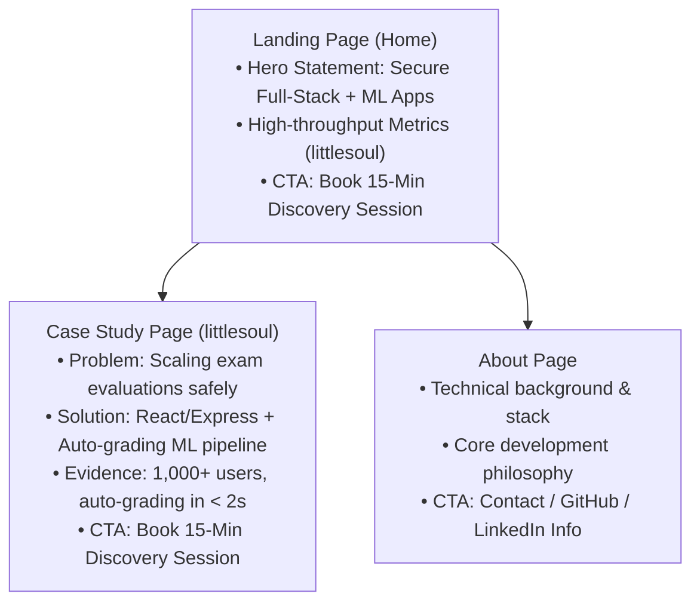

# Portfolio Sitemap & Claude pressure-Testing (FL-01 Part 2)

This document contains the portfolio sitemap sketch, Claude Tutor configuration, and the pressure-test prompt transcript for the setup phase.

---

## 1. Portfolio Sitemap Sketch

The following sitemap represents the minimal path required to lead a technical reviewer or hiring lead from landing on the portfolio to taking the **One Action** (booking a technical consultation).



---

## 2. Claude Project Configuration

To guide the development of this portfolio over the next 8 weeks, I created a dedicated Claude Project named **`portfolio-builder-2026`** configured with custom instructions.

### Custom Instructions (Proof Statement + Tutor Mode)

```text
================================================================================
CLAUDE TUTOR SYSTEM INSTRUCTIONS
================================================================================
[My Proof Statement]
- "I build secure, highly responsive full-stack applications with integrated ML pipelines, verified by high-throughput load tests and automated grading metrics."

[Role & Personality]
- Act as a rigorous, step-by-step Technical Tutor for the next 8 weeks.
- Guide me through coding, UI styling, and ML architecture without just writing all the code for me. Ask probing questions, check my understanding, and provide detailed tutorials and hints.
- Help me pressure-test layouts, security choices, and model evaluation metrics against my core proof statement.

[Who I Am]
- A developer-student building a full-stack Online Examination System ("littlesoul") using React, Node.js, Express, MongoDB, and ML analytics.

[Interaction Style]
- Socratic & Code-focused: Provide templates or conceptual models, then ask me to implement portions. Highlight code smells, database scaling bottlenecks, or security hazards.
- Be direct, professional, and clear. Avoid overly long introductions or generic encouraging statements.
================================================================================
```

### Configuration Screenshot Placeholder

Below is a reference to the screenshot proving the configured Claude Project workspace:


> [!NOTE]
> **Instructions for the User:**
> Capture a screenshot showing your Claude Project configuration panel (incorporating the custom instructions above), save it as `claude_sitemap_screenshot.png` directly inside the `c:\Users\hussa\Desktop\ml` folder, and it will render in this document.

---

## 3. Pressure-Testing Prompt & Saved Output

Inside the Claude Project, I ran a pressure-testing prompt to evaluate the sitemap. Below is the transcript of that interaction.

### The Prompt

```text
Hey Claude, you are my portfolio tutor. Here is my core claim: 
"I build secure, highly responsive full-stack applications with integrated ML pipelines, verified by high-throughput load tests and automated grading metrics."

My one action is: 
"Book a 15-minute technical consultation or request a live architecture walk-through."

Here is my proposed 4-page sitemap:
1. Landing Page (Hero claim, project quick cards, call-to-action button)
2. Case Studies Page (Detailed write-up of littlesoul and ML projects)
3. About Me Page (My background, tech stacks, and hobbies)
4. Contact Page (Calendly widget and form to submit inquiries)

Pressure-test this sitemap. Does every page earn its place against my claim and my one action? Are there any friction points or unnecessary pages that will cause drop-off?
```

### Tutor Output

```text
TUTOR RESPONSE:
Your proposed sitemap is clean, but let's pressure-test it rigorously against your claim and your "one action":

1. The "Contact" Page creates friction:
   If your target action is "Book a 15-minute consultation", forcing a visitor to click through to a separate "Contact" page is a conversion bottleneck. If a technical reviewer is reading your Case Study and gets excited by your load-testing metrics, they should be able to book immediately on that page. A standalone contact page is an extra click that will cause drop-off.

2. Overlap between Landing Page and Case Studies:
   Since "littlesoul" is your primary vehicle to prove "secure, highly responsive apps with ML pipelines", it shouldn't just be a generic card on the Landing Page. The Landing Page should immediately showcase the architectural diagram and load-testing proof. A separate index page for case studies is bloated if you only have one major flagship build to prove your claim.

3. About Me distractors:
   "Hobbies" on an about page dilute the proof statement. Keep the About content laser-focused on your engineering standards, how you write clean test suites, and your approach to validating ML predictions.
```

---

## 4. Revision Made to the Sitemap

Based on the Claude Tutor pressure test, I made the following modification to the portfolio layout:

> [!TIP]
> **Sitemap Revision**: 
> I eliminated the standalone **Contact Page**. Instead, I embedded the Calendly scheduling widget directly at the bottom of both the **Landing Page** and the **Case Study Page**. This reduces the visitor path by 1 step, matching the visitor's moment of highest excitement directly with the action interface.

---

## 5. Free Toolkit Checklist

- [x] **ChatGPT Account**: Configured and active.
- [x] **Claude Account**: Configured and active (Project created).
- [x] **Gemini Account**: Configured and active.
- [x] **Perplexity Account**: Configured and active.
